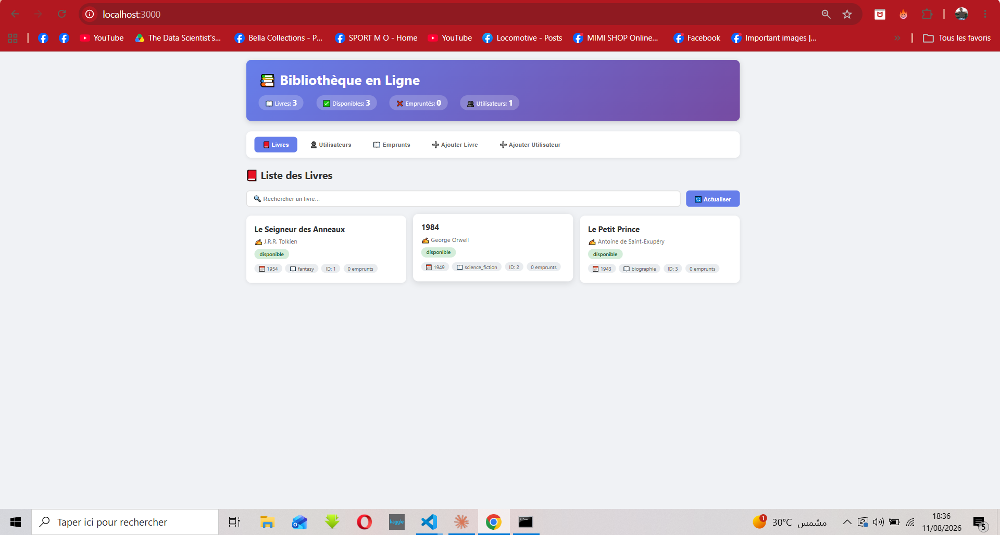
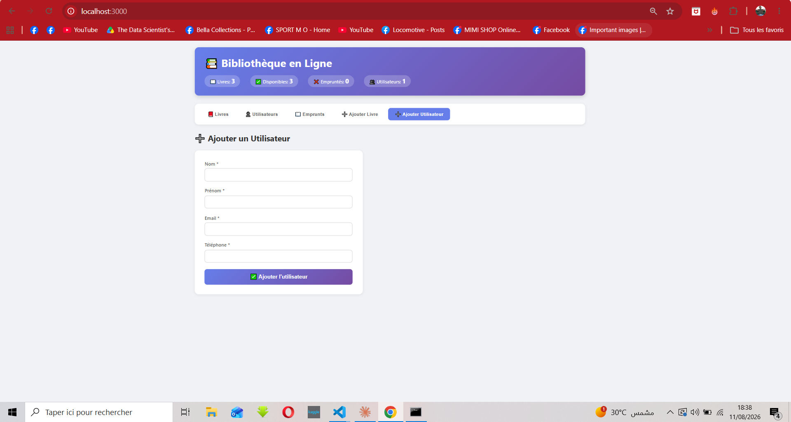
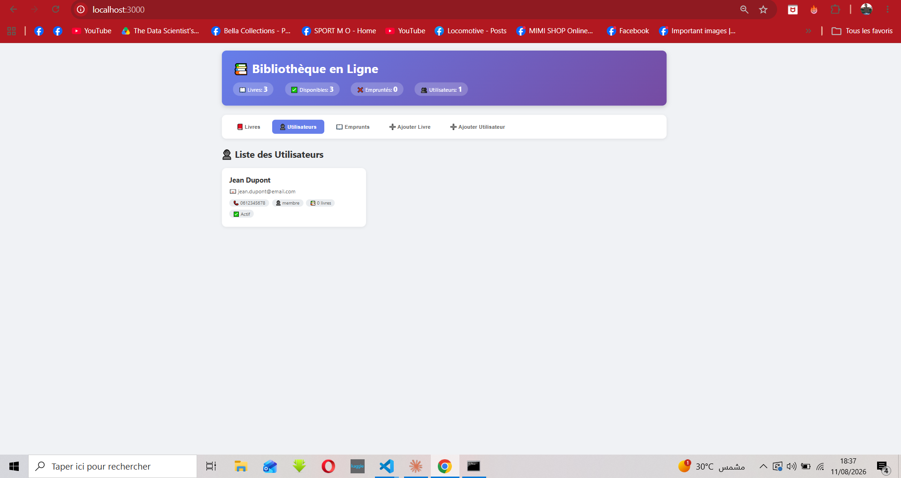

# 📚 Gestionnaire de Bibliothèque
By Kallel Amir
Application web complète de gestion de bibliothèque avec **TypeScript**, **Express** et **interface utilisateur moderne**.



---

## ✨ Fonctionnalités

### 📖 Gestion des livres
- ✅ Visualisation de tous les livres
- ✅ Ajout de nouveaux livres
- ✅ Emprunt et retour de livres
- ✅ Suivi des disponibilités
- ✅ Recherche par titre ou auteur

### 👤 Gestion des utilisateurs
- ✅ Inscription des utilisateurs
- ✅ Liste complète des utilisateurs
- ✅ Suivi des emprunts par utilisateur
- ✅ Gestion des amendes

### 📊 Statistiques en temps réel
- ✅ Nombre total de livres
- ✅ Livres disponibles
- ✅ Livres empruntés
- ✅ Total des utilisateurs

### 💾 Persistance
- ✅ Sauvegarde automatique en JSON
- ✅ Chargement des données sauvegardées

---

## 🛠️ Stack Technique

| Couche | Technologies |
|--------|--------------|
| **Backend** | Node.js, TypeScript, Express |
| **Frontend** | HTML5, CSS3, Vanilla JavaScript |
| **API** | RESTful |
| **Architecture** | Pattern Singleton |
| **Outils** | npm, TypeScript Compiler |

---

## 📸 Captures d'écran

### Page d'accueil - Liste des livres


*Interface principale avec la liste des livres et les statistiques en temps réel*

### Ajout d'un utilisateur


*Formulaire d'inscription avec validation des données*

### Gestion des emprunts


*Emprunt et retour de livres en temps réel avec calcul automatique des amendes*

### Liste des utilisateurs


*Visualisation de tous les utilisateurs inscrits avec leurs emprunts*

---


## 🚀 Installation et démarrage

### Prérequis

- Node.js (v18 ou supérieur)
- npm

### Installation

```bash
# Cloner le projet
git clone https://github.com/votre-username/bibliotheque.git
cd bibliotheque

# Installer les dépendances
npm install

# Compiler le TypeScript
npm run build

# Lancer en développement
npm run dev

## 🌐 Démo en ligne

L'application est disponible en ligne :

🔗 [https://bibliotheque-production-6cd3.up.railway.app](https://bibliotheque-production-6cd3.up.railway.app)